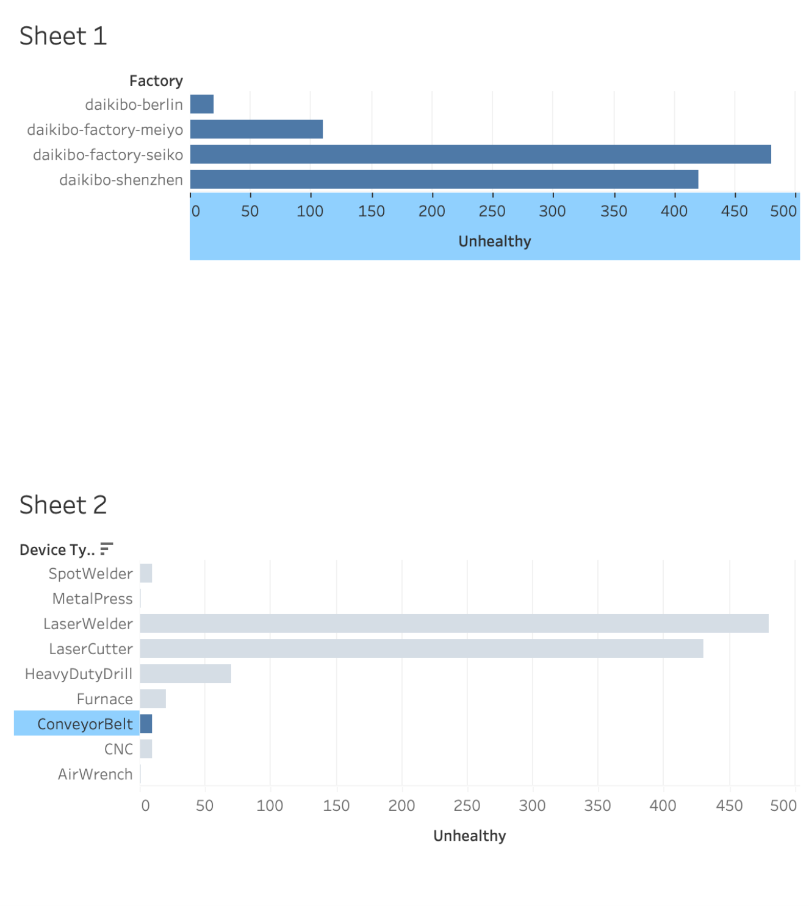

# Deloitte Australia – Data Analytics Job Simulation

## Overview

Completed the Deloitte Australia Data Analytics Job Simulation on Forage.

This project focuses on analyzing manufacturing data using Excel and Tableau to identify operational issues and present insights through interactive visualizations.

---

## Objectives

- Analyze factory equipment data
- Identify unhealthy machine trends
- Create meaningful Tableau visualizations
- Support data-driven business decisions

---

## Tools & Technologies

- Microsoft Excel
- Tableau
- Data Cleaning
- Data Visualization

---

## Project Files

- Deloitte_Task2.xlsx – Dataset used for analysis
- dashboard.png – Tableau visualization

---

## Dashboard Preview

---

## Key Insights

- Daikibo Factory Seiko recorded the highest number of unhealthy machines.
- Laser Welder and Laser Cutter showed the highest unhealthy equipment counts.
- Dashboard enables quick identification of maintenance priorities.

---

## Skills Demonstrated

- Data Cleaning
- Data Analysis
- Tableau
- Dashboard Design
- Business Intelligence
- Data Visualization
